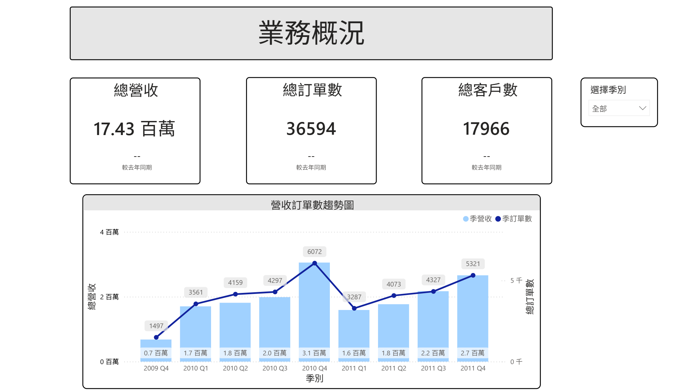
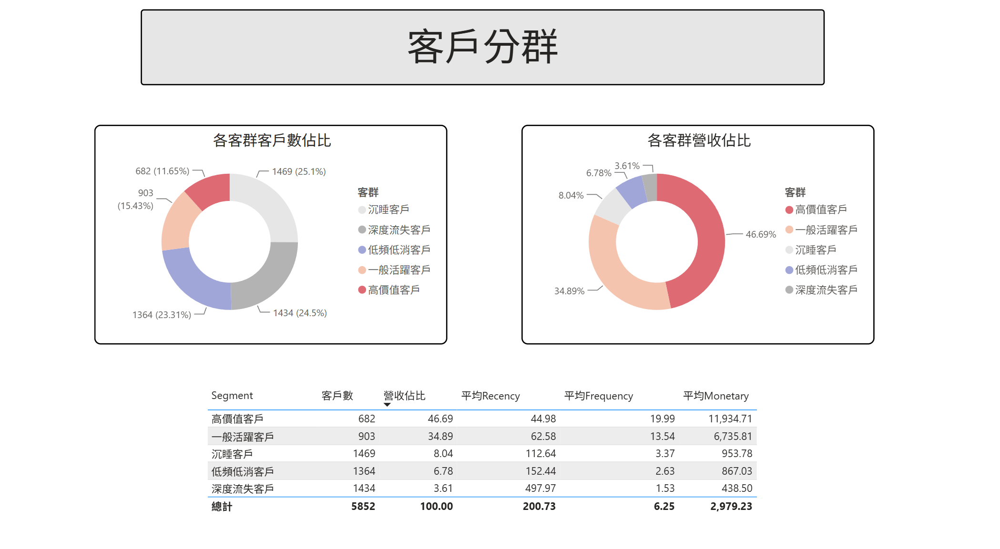

# CRM 客戶分群分析作品集
## 批發商客戶採購行為與價值分群分析

---

## 🔗 快速連結
-  [Power BI Dashboard](https://app.powerbi.com/reportEmbed?reportId=be9e0aa3-8952-48a5-9699-8ee20d3e8002&autoAuth=true&ctid=62c9c600-58b7-410d-806a-f711e71bd333)
-  [分析 Notebook](notebook/crm_profolio.ipynb)

---

## 專案背景

本專案使用 Kaggle網站 的
[Online Retail II 資料集](https://www.kaggle.com/datasets/mashlyn/online-retail-ii-uci/data)，
涵蓋一家英國電商平台於 2009-12 至 2011-12 間的交易紀錄。

該平台的主要客戶為「批發商」，採購週期較一般零售消費者長，
月留存率偏低是正常的採購節奏反映，
分析時需以批發商的業務邏輯解讀數據。

---

## 分析目標

本專案從兩個維度切入，建立完整的客戶管理框架：

### 問題一：客戶採購週期與長期穩定性（Cohort 分析）
> 透過 Cohort 分析觀察各批次客戶的長期採購趨勢，
> 識別採購逐漸萎縮的客群，作為主動維繫的依據。

### 問題二：客戶價值分群與預算差異化分配（RFM + K-Means）
> 透過 RFM 分群識別不同價值的客群，
> 讓行銷資源依據客群價值差異進行差異化分配。

---

## 技術架構

原始資料  
↓  
資料清洗（Python / BigQuery SQL）  
↓  
EDA 探索性分析（Python）  
↓  
Cohort 分析（Python）  
↓  
RFM 計算 + K-Means 分群（Python / BigQuery ML）  
↓  
Power BI Dashboard  

---

## 使用技術

| 工具 | 用途 |
|---|---|
| Python(Pandas/) | 資料清洗、EDA、RFM 計算、K-Means 分群 |
| BigQuery SQL | SQL 版 RFM 計算、K-Means 模型訓練 |
| Power BI | 互動式 Dashboard |

---

## BigQuery 資料架構

online_retail        → 原始資料  
orders_clean         → 清洗後資料（含年月、年季欄位）  
rfm_base             → RFM 計算結果  
kmeans_rfm           → K-Means 模型  
rfm_segments         → 分群結果（含語意化名稱）  
quarterly_summary    → 季度彙總（含年增率）  

---

## 主要發現

### Cohort 分析
- 批發商月留存率整體落在 15-35%，符合長採購週期的正常行為
- Q4（10-11月）採購活躍度明顯提升，反映節慶備貨的季節性規律
- 各 Cohort 長期採購趨勢穩定，客戶基礎紮實

### RFM 分群（K=5）

| 客群 | 客戶數 | 營收佔比 | 平均Recency | 平均Frequency | 平均Monetary |
|---|---|---|---|---|---|
| 高價值客戶 | 682 | 46.69% | 45 天 | 20 次 | 11,935 |
| 一般活躍客戶 | 903 | 34.89% | 63 天 | 14 次 | 6,736 |
| 沉睡客戶 | 1,469 | 8.04% | 113 天 | 3 次 | 954 |
| 低頻低消客戶 | 1,364 | 6.78% | 152 天 | 3 次 | 867 |
| 深度流失客戶 | 1,434 | 3.61% | 498 天 | 2 次 | 439 |

---

## Dashboard 預覽

### 第一頁：業務概況

### 第二頁：客戶分群

---

## 分析限制

- 資料僅涵蓋兩年，不足以完整觀察批發商的長期採購週期
- 以英國市場為主（約 87%），結論泛化性有限
- 缺乏客戶產業別資訊，無法細分不同類型批發商的行為差異

---

## 後續延伸方向

- CLTV 預測
- A/B Testing 驗證沉睡客戶的挽回策略
- 季度 Cohort 分析（更符合批發商採購週期）
